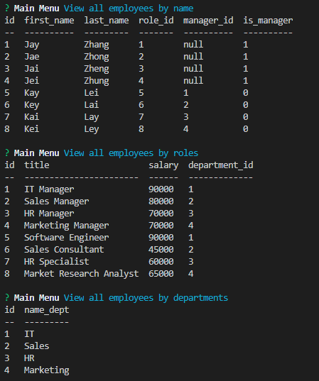

# Track-My-Team!

## Description

This application is intended to help managers keep track of their team (employees).

## Table of Contents

* [Features](#Features)
* [Links](#Links)
* [Demo](#Demo)
* [Language](#Language)
* [Installation](#Installation)
* [Reference](#Reference)
* [Contribute/Credits](#Contribute/Credits)
* [License](#License)

## Features
Main Features: 
- [x] Users can add new employees
- [x] Users can add new roles
- [x] Users can add new departments
- [x] Users can view employees by name
- [x] Users can view roles
- [x] Users can view departments
- [x] Users can update employees

## Links

* Project Repo: [Repository](https://github.com/jeishu/track-my-team)
* Video Demo: [Link](https://drive.google.com/file/d/118iDDsOkW16nNrlX02p-yEHUaN6oYMQI/view)

## Demo



## Language

* JavaScript
* HTML
* CSS

## Installation

Install Node Modules folder
```
npm i
```

Install Dependencies
```
npm i mysql
npm i inquirer
```

## Reference

These are websites I used to aid me in making my portfolio.

> - [Developer Mozilla](https://developer.mozilla.org/en-US/)
> - [W3School](https://www.w3schools.com/) 
> - [StackOverflow](https://www.stackoverflow.com/) 

These websites aid me in creating this README.

> - [GitHub Docs](https://docs.github.com/en/free-pro-team@latest/github/writing-on-github/basic-writing-and-formatting-syntax) || Learn most of my README syntax here.
> - [Akash Nimare](https://medium.com/@meakaakka/a-beginners-guide-to-writing-a-kickass-readme-7ac01da88ab3) || Based my README from his person.
> - [Mark Down Guide](https://www.markdownguide.org/cheat-sheet/) || README Syntax

## Contribute/Credits

I used npm i for installation and Inquirer and Mysql for the this application.
- Shoutout to my classmate Joey for helping with MYSQL syntax and Javascript code.

## License

MIT © [Jeremy Zhu](https://github.com/jeishu)